# Distributed_KV_Store

## 项目介绍

支持 HTTP、RPC 和服务注册发现的分布式键值存储系统；

本轮子项目参考了 geecache、groupcache、gcache 等项目，对项目中每个模块的设计和实现进行了详细分析（共 9 个部分，参见项目分析部分）；

## 功能扩展
- 支持 RPC 
- 支持多种缓存淘汰策略（LRU、LFU、FIFO）
- 支持服务注册发现（etcd cluster）
- 支持从 etcd 获取服务节点信息
- 支持全局日志处理
- 提供了自动化测试脚本

## 功能优化方向（todo）

1. 添加缓存命中率指标（动态调整缓存容量）
2. 自动检测服务节点信息变化，动态增删节点
3. 增加更多的负载均衡策略（轮询等）
4. 增加请求限流（令牌桶算法）
5. 增加 ARC 缓存淘汰算法
...

# 项目结构
```
.
├── README.md
├── api
│   ├── ggcache
│   ├── groupcachepb
│   │   ├── groupcache.pb.go
│   │   ├── groupcache.proto
│   │   ├── groupcache_grpc.pb.go
│   ├── studentpb
│   │   ├── student.pb.go
│   │   ├── student.proto
│   │   └── student_grpc.pb.go
│   └── website
│       └── website.proto
├── assets
│   ├── image
│   └── sql
├── cmd
│   ├── grpc
│   │   ├── grpc1
│   │   │   └── main.go  
│   │   ├── grpc2
│   │   │   └── main.go
│   │   └── main.go
│   └── http
│       └── main.go
├── config
│   ├── config.go
│   └── config.yml
├── go.mod
├── go.sum
├── internal
│   ├── middleware
│   │   └── etcd
│   │       ├── cluster
│   │       ├── discovery
│   │       ├── list_peers.go
│   │       └── put
│   ├── pkg
│   │   ├── student
│   │   │   ├── dao
│   │   │   ├── ecode
│   │   │   ├── model
│   │   │   └── service
│   │   └── website
│   └── service
│       ├── byteview.go
│       ├── cache.go
│       ├── cachepurge
│       │   ├── fifo
│       │   ├── interfaces
│       │   ├── lfu
│       │   ├── lru
│       │   └── purge.go
│       ├── consistenthash
│       │   ├── consistenthash.go
│       │   └── constenthash_test.go
│       ├── discover.go
│       ├── group.go
│       ├── groupcache.go
│       ├── grpc_fetcher.go
│       ├── grpc_picker.go
│       ├── http_fetcher.go
│       ├── http_helper.go
│       ├── http_picker.go
│       ├── interface.go
│       ├── policy
│       ├── register.go
│       └── singleflight
│           └── singleflight.go
├── main.go
├── script
│   ├── exec_test.sh
│   ├── other
│   ├── prepare
│   │   └── exec1.sh
│   └── test
│       ├── grpc1
│       │   └── grpc_client1.go
│       ├── grpc2
│       │   └── grpc_client2.go
│       └── http
│           ├── http_test1.sh
│           └── http_test2.sh
└── utils
    ├── logger
    ├── shutdown
    ├── trace
    └── validate
49 directories, 64 files
```


## 使用

1. 启动 etcd 集群

进入 /etcd/cluster 目录，分别运行

```bash
cd /etcd/cluster
```
```bash 
go install github.com/mattn/goreman@latest
```

```bash
goreman -f Procfile start
```


查看成员状态


2. 将三个服务节点的信息保存到 etcd 集群中

进入 server_register_to_etcd 

```bash
cd ../server_register_to_etcd
go run put1/client_put1.go && go run put2/client_put2.go && go run  put3/client_put3.go
```
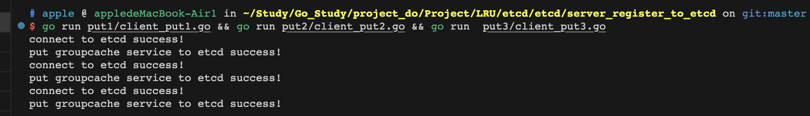

查询是否成功

```bash
etcdctl get clusters --prefix
```
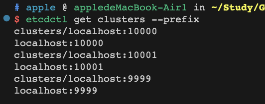

3. 启动自动化测试脚本

- 启动 3 个服务节点
- 发起单次 RPC 请求
- 基于服务注册发现，循环发起 RPC 请求

进入 script 目录，依次执行

```bash
cd ../../script

```

- 后端数据库、缓存初始数据写入成功 

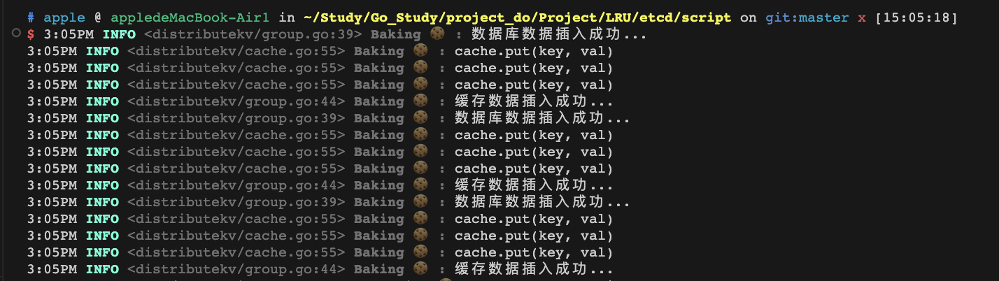

- 集群节点的信息存储成功

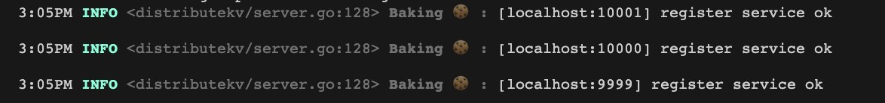

- 超时节点将被踢出集群（keep-alive 心跳机制，可以自定义 TTL）

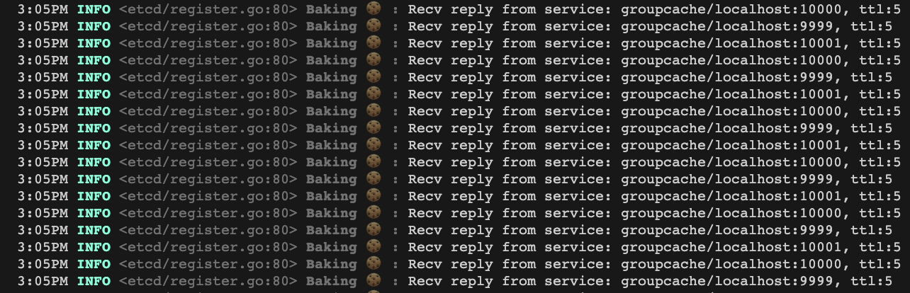

现在服务启动成功，我们可以运行测试脚本（开一个新的终端）：

```bash
./test.sh
```

单次 RPC 请求调用的响应：
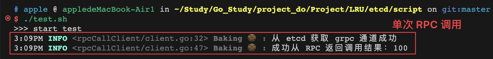

基于服务注册发现，循环发起 RPC 请求调用结果：
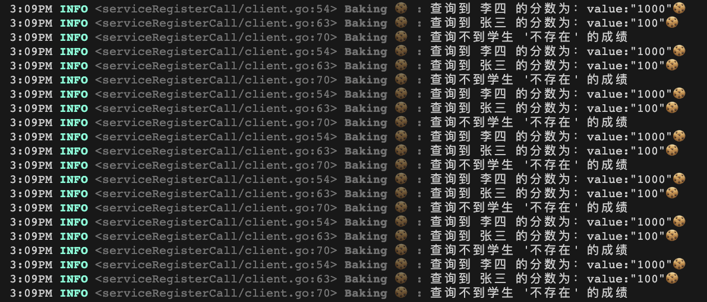


## 执行日志分析

定义：

- 第一个节点（localhost:9999）；
- 第二个节点（localhost:10000）；
- 第三个节点（localhost:10001）；

### 缓存未命中

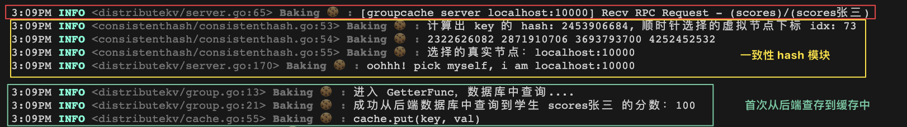

第一个 RPC 请求到达后，第二个节点（localhost:10000）接收到，一致性 hash 模块计算 key 的 hash 值，得到 2453906684 ，然后去哈希环上顺时针找大于等于这个 hash 值的首个虚拟节点，找到了哈希环上的第 74 个节点（对应下标 idx=73）；然后再去查虚拟节点和真实节点的映射表，发现这个虚拟节点对应的真实节点正是第二个节点（localhost:10000）；即由该节点负责处理这个 RPC 请求，因为缓存中还没有这个 key 的缓存，所以需要从数据库中查询，然后将查询结果写入缓存，并返回给客户端。（对照日志输出理解）

### 请求转发
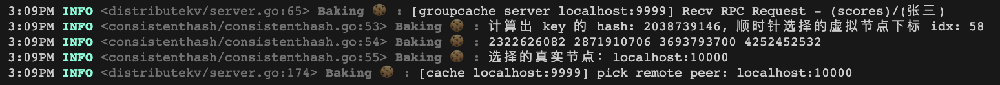

RPC 请求由第一个节点（localhost:9999）接收到，一致性 hash 模块计算后将 key 打到了第二个节点上（localhost:10000），第一个节点将请求转发给第二个节点处理（pick remote peer）。

查看第二个节点日志，发现它收到了来自第一个节点的转发请求，

```
3:09PM INFO <distributekv/server.go:65> Baking 🍪 : [groupcache server localhost:10000] Recv RPC Request - (scores)/(张三)
计算出 key 的 hash: 2038739146, 顺时针选择的虚拟节点下标 idx: 58, 选择的真实节点：localhost:10000，pick myself, i am localhost:10000；
3:09PM INFO <distributekv/group.go:13> Baking 🍪 : 进入 GetterFunc，数据库中查询....
3:09PM INFO <distributekv/group.go:21> Baking 🍪 : 成功从后端数据库中查询到学生 张三 的分数：100
3:09PM INFO <distributekv/cache.go:55> Baking 🍪 : cache.put(key, val)
```

日志内容很详细：收到转发的请求、根据一致性 hash 算法计算出真实节点（发现就是自己）、从后端数据库查询 'key=张三' 的值，返回 100、最终客户端收到 RPC 响应；

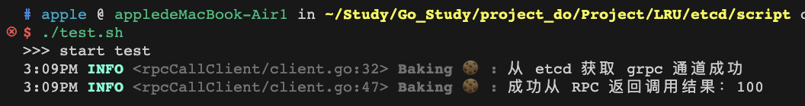

### 缓存命中

我们已经将 'key=张三' 的成绩存入到节点 2 的缓存中了，按照正常处理逻辑，下一次查询时应该走缓存而不是慢速数据库，我们再发起一次请求：

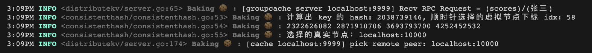

根据日志输出可知：一致性 hash 算法将相同的 key 打到了相同的节点上（一致性 hash 算法有效），同样的，节点 1 成功将 RPC 请求转发给了节点 2（分布式节点集群通信正常）；

最后我们还需要验证一下节点 2 的缓存是否生效：

节点 2 的日志：
```bash
3:09PM INFO <distributekv/groupcache.go:94> Baking 🍪 : cache hit...
```

客户端日志：
```bash
3:09PM INFO <rpcCallClient/client.go:47> Baking 🍪 : 成功从 RPC 返回调用结果：100
```

## 参考资源链接
1. [ Geektutu]( https://geektutu.com/post/geecache.html) 分布式缓存 GeeCache
2. [gcache](https://github.com/bluele/gcache) 缓存淘汰策略（基于策略模式）
3. [groupcache](https://github.com/golang/groupcache) 常作为 memcached 替代
4. [grpc](https://grpc.io/docs/languages/go/quickstart/) gRPC 官方文档
5. [proto3](https://protobuf.dev/programming-guides/proto3/) protobuf 官方文档
6. [protobuf](https://www.notion.so/blockchainsee/Protocol-Buffer-04cba19af055479299507f04d0a24862) protobuf 编码原理
7. [protoscope](https://www.notion.so/blockchainsee/protoscope-fbfe36c2eef64bfcb630be4f0bd673f5) proto 个人学习笔记
8. [etcd](https://etcd.io/docs/v3.5/) 官方文档
9. [goreman](https://github.com/mattn/goreman) etcd 集群搭建
10. [shell](https://www.shellscript.sh/) shell 脚本
11. [gorm](https://gorm.io/docs/models.html) 快速搭建后端数据库
12. [air](https://github.com/cosmtrek/air) 动态加载（方便调试）
13. [log](https://github.com/charmbracelet/log) 极简、多彩的 Go 日志库

