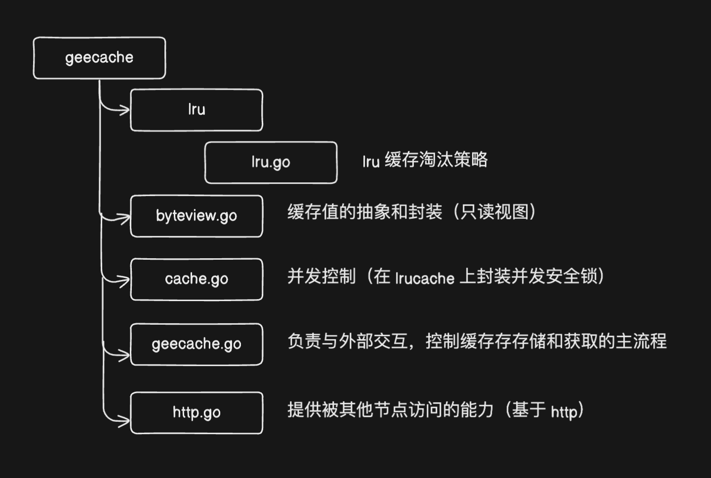

# HTTP 服务端

本部分介绍如何使用 go 语言标准库 http 搭建 http server，并实现 main 函数启动 http server 测试 api；

# http 标准库

golang 提供了 net/http 标准库，可以非常方便的搭建 HTTP 服务端和客户端；

net/http 中有一个 Handler 接口，任何实现了 Handler 接口中定义的唯一 ServeHTTP 方法的对象均可以作为 HTTP 的 Handler。

```go
package http

type Handler interface{
  ServeHTTP(w ResponseWriter, r *Request)
}
```

比如我们可以自定义一个 handler，任何访问它的请求默认返回固定的字符串值；

```go
func main

import (
  "log"
  "net/http"
)

type server int

func (h *server) ServeHTTP(w http.ResponseWriter, r *http.Request) {
    log.Println(r.URL.Path)
    w.Write([]byte("Hello World!"))
}

func main() {
  var s server
  http.ListenAndServe("localhost:9999", &s)
}
```

1. 创建任意类型 server，实现 ServeHTTP 方法
2. 调用 http.ListenAndServe 在端口 9999 启动 http 服务，处理请求的对象是 s；

假设使用如下命令访问，curl http://localhost:9999**/abc**

打印的 path 值为：**/abc**

> http.ListenAndServe 接收 2 个参数，第一个参数是服务启动的地址，第二个参数是 Handler，任何实现了 ServeHTTP 方法的对象都可以作为 HTTP 的 Handler 参数传入。

基础部分到此结束，开始实现 cache 的 HTTP服务端；

# HTTP Server

分布式缓存节点需要实现相互通信，建立基于 HTTP 的通信机制是比较常见和简单的做法。

如果分布式缓存中的某个节点开启了 HTTP 服务，那么这个节点就可以被其他节点访问。

今天，先搭建一个单机版的 HTTP Server，接下来再扩容到多机，即分布式场景。

HTTP Server 部分不与项目其他部分耦合，我们将这部分代码放在新的 http.go 文件中。代码结构如图：



## 结构体 HTTPPool

我们创建一个 HTTPPool 结构体 ，作为承载节点间 HTTP 通信的核心数据结构（包括服务端和客户端，今天只实现服务端）；

```go
const defaultBasePath = "/_geecache"

type HTTPPool struct {
  // this peer's base URL ："https://exmaple.net:8000"
  self string  
  basePath string
}

// NewHTTPPool initializes an HTTP pool of peers
func NewHTTPPool(self string) *HTTPPool {
  return &HTTPPool{
    self: self,
    basePath: defaultBasePath, 
  }
}
```

1. HTTPPool 只有 2 个参数，一个是 self，用来记录自己的地址，包括主机名/IP 和端口号；
2. 另一个是 basePath，它作为节点之间通信地址的前缀，默认为 "/_geecache/"

> [http://example.com/_geecache/](http://example.com/_geecache/)  

因为一个主机上还可能承载其他的服务，所以多加一段 path 是一个好习惯，大部分网站的 api 接口，一般以 /api 作为前缀；

接下来我们为 HTTPPool 实现 ServeHTTP 方法，使其可以作为 HTTP 的 Handler 使用。

```go
// Log info with server name
func (p *HTTPPool) Log(format string, v ...interface{}) {
  log.Printf("[Server %s] %s", p.self, fmt.Sprintf(format, v...))
}

// ServeHTTP handle all http request
func (p *HTTPPool) ServeHTTP(w http.ResponseWriter, r *http.Request) {
  if !strings.HasPrefix(r.URL.Path, p.basePath) {
    panic("HTTPPool serving unexpected path: "+ r.URL.Path)
  }
  // 如果请求路径验证通过，打印请求的方法和路径(请求的资源）
  p.Log("%s %s", r.Method, r.URL.Path)
  // /<basepath>/<groupname>/<key> required
    parts := strings.SplitN(r.URL.Path[len(p.basePath):], "/", 2)
    if len(parts) !=  2 {
      http.Error(w, "bad request", http.StatusBadRequest)
      return
    }
    groupName := parts[0]
    key := parts[1]
    
    group := GetGroup(groupName)
    if group == nil {
      http.Error(w, "no such group" + groupName, http.StatusNotFound)
      return
    }
    
    view, err := group.Get(key)
    if err != nil {
      http.Error(w, err.Error(), http.StatusInternalServerError)
      return
    }
    w.Header().Set("Content-Type", "application/octet-stream")
    w.Write(view.ByteSlice())
}
```
1. 首先判断访问路径的前缀是否是 basePath （/_geecache/），不会则返回错误
2. 如果是，那么按照我们约定的访问路径格式
	1. /<basePath>
	2. /<groupname>
	3. /<key>
	4. 进行解析，并对解析结果进行合法性判定；
3. 如果解析的结果合法，那么通过 groupname 获取 group 实例（查询 groups），然后再调用该实例的 Get 方法获取缓存数据；
4. 最终将获取到的数据的深拷贝通过 Write 方法写入响应体中返回给请求方。（**最终使用 w.Write() 将缓存值的副本作为 httpResponse 的 Body 返回**）

> application/octet-stream 是一种通用的二进制数据类型，用于传输任意类型的二进制数据，没有特定的结构或者格式，可以用于传输图片、音频、视频、压缩文件等任意二进制数据。在本项目中，我们将缓存数据包装成 ByteView 结构体中的字节类型，因此我们所有要在网络中传输的数据都是可以以二进制传输的字节数组形式。因此我们将 Content-Type 设置为 application/octet-stream 这种通用的二进制数据类型。**application/octet-stream 通常在下载文件场景中使用，它会告知浏览器写入的内容是一个字节流，浏览器处理字节流的默认方式就是下载。**

> **application/json ：用于传输 JSON（Javascript Object Notation）格式的数据，JSON 是一种轻量级的数据交换格式，常用于 Web 应用程序之间的数据传输。**

> application/xml：用于传输 XML（eXtensible Markup Language）格式的数据，XML 是一种标记语言，常用于数据的结构化表示和交换。

> text/plain：用于传输纯文本数据，没有特定的格式或者结构，可以用于传输普通文本、日志文件等。

> **multipart/form-data：用于在 HTML 表单中上传文件或者二进制数据，允许将表单数据和文件一起传输。**

> image/jpeg、image/png、image/gif：用于传输图片数据，分别对应 JPEG、PNG 和 GIF 格式的图片。

> audio/mpeg、audio/wav：用于传输音频数据，分别对应 MPEG 和 WAV 格式的音频

> video/map、video/quicktime：用于传输视频数据，分别对应 MAP4 和 Quicktime 格式的视频。

到这里，HTTP 服务端已经完整实现了，下面我们在单机上启动 HTTP 服务，使用 curl 进行测试。

# 测试

实现 main 函数，实例化 group，并启动 HTTP服务。

- 不连接数据库测试了，使用 map 模拟实现一个慢速数据库吧；
- 单机环境没有路由组这个概念了：直接自己实例化一个 Group 吧；
- 使用指定 host/IP 作为 self 参数构造 HTTPPool 对象作为被选中的缓存节点（Handler），使用该对象为 HTTP 提供服务。

```go
// 模拟慢速数据库查询
var db = map[string]string{
	"Tom":  "630",
	"Jack": "589",
	"Sam":  "567",
}

func main() {
  geecache.NewGroup("scores", 2<<10, geecache.GetterFunc(
  func(key string) ([]byte, error) {
    log.Println("[slowdb] search key", key)
	if v, ok := db[key]; ok {
      	  return []byte(v), nil
	}

    return nil, fmt.Errorf("%s not exist", key)
  }))

  addr := "localhost:9999"
  peersHandle := geecache.NewHTTPPool(addr)

  log.Println("geecache is running at", addr)
  log.Fatal(http.ListenAndServe(addr, peersHandle))
}
```

