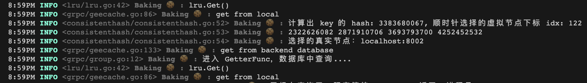
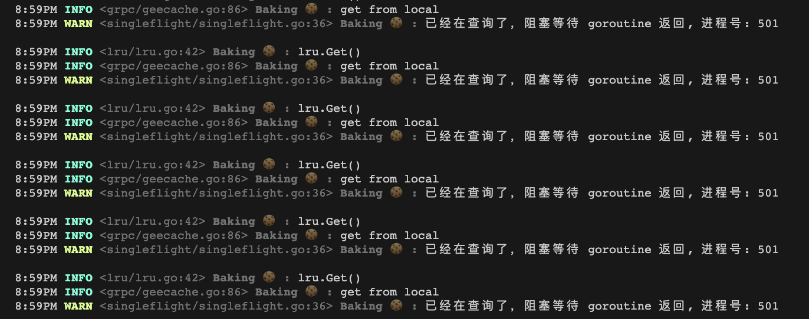
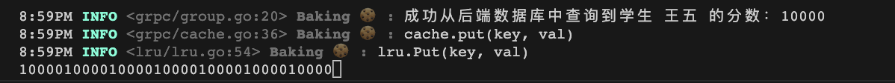

1. 定义 proto 文件

```protobuf
syntax="proto3";

package groupcachepb;

// 相对于 proto 文件来说的路径
option go_package = ".";

message GetRequest {
    string group = 1;
    string key = 2;
}

message GetResponse {
    bytes value = 1;
}

service GroupCache {
    rpc Get(GetRequest) returns (GetResponse);
}
```

2. 使用 protoc 工具生成指定的 xxx.pb.go 和 xxx_grpc.pb.go 文件

> protoc --go_out=./grpcpb --go_opt=paths=source_relative \
--go-grpc_out=./grpcpb --go-grpc_opt=paths=source_relative \
groupcache.proto

生成的文件参见：grpcpb

3. 分别实现 RPC 的客户端和服务端

我们先看下 geecache 的实现

client.go

```go
func StartHTTPAPIServer(apiAddr string, gee *geecache.Group) {
	// 注册路由到全局默认的多路复用器
	http.Handle("/api", http.HandlerFunc(func(w http.ResponseWriter, r *http.Request) {
		key := r.URL.Query().Get("key")
		view, err := gee.Get(key)
		if err != nil {
			http.Error(w, err.Error(), http.StatusInternalServerError)
			return
		}

		w.Header().Set("Content-Type", "application/octet-stream")
		w.Write(view.Bytes())
	}))
	logger.Logger.Infof("fontend api server is running at %s", apiAddr)
	logger.Logger.Fatal(http.ListenAndServe(apiAddr[7:], nil))
}
```

它使用的实际还是基于 http 通信，并没有利用 RPC 通信。

server.go
```go
// server
func startCacheServerGrpc(addr string, addrs []string, groupcache *grpc.Group) {
	// 启动服务
	grpcPool := grpc.NewGrpcPool(addr)
	grpcPool.AddPeers(addrs...)
	groupcache.SetPeerPicker(grpcPool)

	logger.Logger.Infof("grpc groupcache is running at %v", addr)
	grpcPool.Run()
}

func StartGrpcServer() {
	var port, clientPort int
	var api bool
	flag.IntVar(&port, "port", 8000, "grpc groupcache server port")
	flag.BoolVar(&api, "api", false, "grpc groupcache api server")
	flag.IntVar(&clientPort, "clientPort", 9000, "grpc groupcache client port")
	flag.Parse()

	apiAddr := fmt.Sprintf("http://localhost:%v", clientPort)
	addrMap := map[int]string{
		8001: "localhost:8001",
		8002: "localhost:8002",
		8003: "localhost:8003",
	}
	var addrs []string
	for _, v := range addrMap {
		addrs = append(addrs, v)
	}

	grpcgroup := grpc.NewGroupInstance("scores")
	if api { // client api
		go StartAPIServer(apiAddr, grpcgroup)
	}
	startCacheServerGrpc(addrMap[port], addrs, grpcgroup)
}

func StartAPIServer(apiAddr string, gee *grpc.Group) {
	// 注册路由到全局默认的多路复用器
	http.Handle("/api", http.HandlerFunc(func(w http.ResponseWriter, r *http.Request) {
		key := r.URL.Query().Get("key")
		view, err := gee.Get(key)
		if err != nil {
			http.Error(w, err.Error(), http.StatusInternalServerError)
			return
		}
		w.Header().Add("Content-Type", "application/octet-stream")
		w.Write(view.Bytes())
	}))
	logger.Logger.Infof("fontend api server is running at %s", apiAddr)
	logger.Logger.Fatal(http.ListenAndServe(apiAddr[7:], nil))
}

```

可以看到没有使用到任何生成的代码，只是在原来 http 服务基础上改了一些结构体的名称，为了方便观察，我添加了 logger 和 mysql，并在一些地方输出了日志提示，可以帮助分析处理流程。

# 往数据库和缓存中存入一些测试数据

```go
func NewGroupInstance(groupname string) *Group {
	g := NewGroup(groupname, 1<<10, func(key string) ([]byte, error) {
		// 从后端数据库中查找
		logger.Logger.Info("进入 GetterFunc，数据库中查询....")
		var scores []*db.Student
		db.DB.Where("name = ?", key).Find(&scores)
		if len(scores) == 0 {
			logger.Logger.Info("后端数据库中也查询不到...")
			return []byte{}, errors.New("record not found")
		}

		logger.Logger.Infof("成功从后端数据库中查询到学生 %s 的分数：%s", key, scores[0].Score)
		return []byte(scores[0].Score), nil
	})

	groups[groupname] = g
	InitDataWithGroup(g)
	return g
}

func InitDataWithGroup(g *Group) {
	dataPrefix := g.name
	// 先往数据库中存一些数据（慢速数据库）
	db.DB.Create(&db.Student{Name: dataPrefix + "张三", Score: "100"})
	db.DB.Create(&db.Student{Name: dataPrefix + "李四", Score: "1000"})
	db.DB.Create(&db.Student{Name: dataPrefix + "王五", Score: "10000"})
	db.DB.Create(&db.Student{Name: dataPrefix + "hihihi", Score: "100"})
	db.DB.Create(&db.Student{Name: dataPrefix + "hi", Score: "1000"})
	db.DB.Create(&db.Student{Name: dataPrefix + "hihi", Score: "10000"})
	logger.Logger.Info("数据库数据插入成功...")
	// 往缓存中存储一些元素
	g.mainCache.put(dataPrefix+"abc", ByteView{b: []byte("123")})
	g.mainCache.put(dataPrefix+"bcd", ByteView{b: []byte("234")})
	g.mainCache.put(dataPrefix+"cde", ByteView{b: []byte("345")})
	logger.Logger.Info("缓存数据插入成功...")
}

```


## 主函数

```../go
package main

import (
	"../day7/conf"
	"day7/db"
	"day7/logger"
	"day7/services"
	"sync"
)

var once sync.Once

func Init() {
	once.Do(func() {
		conf.Init()
		logger.Init()
		db.Init()
	})
}

func main() {
	Init()
	services.StartGrpcServer()
}
```

## 测试脚本

```bash
#! /bin/bash
trap "rm day7;kill 0" EXIT

# 需要自己先手动启动两个 server（兼职 client）

go build -o day7
./day7 -port=8002 -clientPort=9002 -api &
./day7 -port=8003 -clientPort=9003 -api &
./day7 -port=8001 -clientPort=9001 -api

sleep 2
echo ">>> start test"
# & 防止阻塞，异步调用
curl "http://localhost:9002/api?key=王五" &
curl "http://localhost:9002/api?key=王五" &
curl "http://localhost:9002/api?key=王五" &
curl "http://localhost:9002/api?key=王五" &
curl "http://localhost:9002/api?key=王五" &
curl "http://localhost:9002/api?key=王五" &
curl "http://localhost:9002/api?key=王五" &

wait
```

## 测试结果分析

第一个请求到达，根据一致性 hash 算法计算出分配给哪个节点处理


Single 机制发挥作用，其他并发请求等待



结果一起返回

